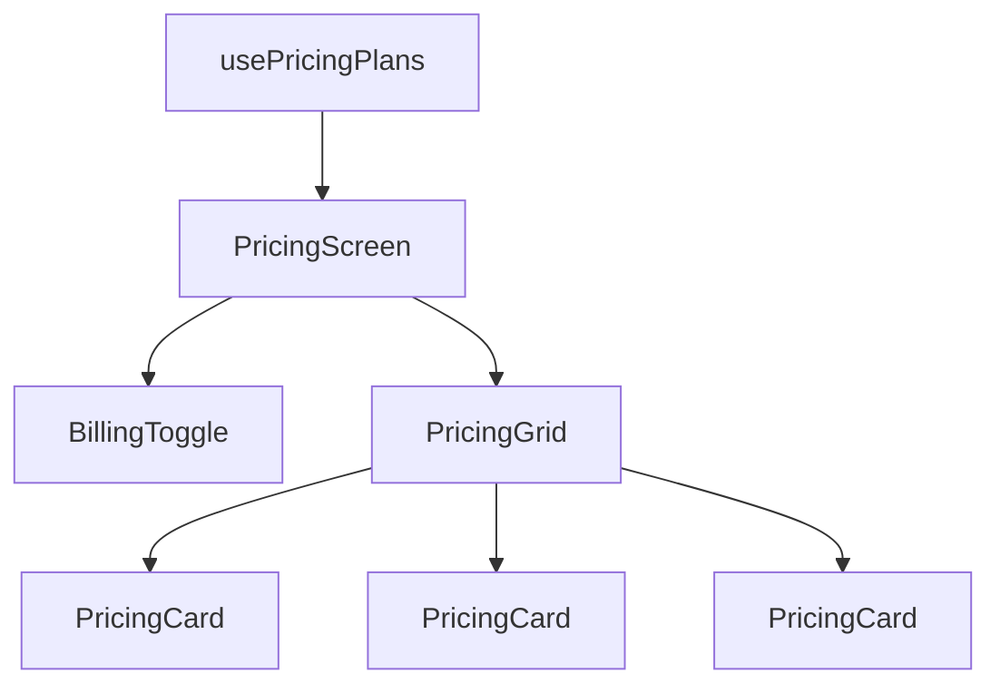

# Pricing Components

The pricing module provides a flexible, composable pricing display system with support for monthly/annual billing cycles and plan highlighting.

## Components Overview

<CardGroup cols={3}>
  <Card title="PricingGrid" icon="grip">
    Responsive grid layout for displaying multiple pricing plans
  </Card>
  <Card title="BillingToggle" icon="toggle-on">
    Monthly/Annual billing cycle switcher
  </Card>
  <Card title="PricingCard" icon="credit-card">
    Individual plan card with features and CTA
  </Card>
</CardGroup>

---

## PricingGrid

A responsive grid container that displays pricing plans in a 3-column layout on desktop, adapting to single column on mobile.

### Props

<ParamField path="plans" type="(Plan & { currentPrice: number })[]" required>
  Array of plan objects with pricing information. Each plan includes base `Plan` properties plus a calculated `currentPrice` based on billing cycle.
</ParamField>

### Plan Type Structure

```typescript modules/prices/types/plan.ts
export interface Plan {
  id: string;
  name: string;
  description: string;
  priceMonth: number;
  priceYear: number;
  features: string[];
  buttonText: string;
  highlight: boolean;
}
```

### Usage

```tsx modules/prices/screens/pricing-screen.tsx
import { PricingGrid } from "../components/pricing-grid";
import { usePricingPlans } from "../hooks/usePrincingPlans";

export function PricingScreen({ initialPlans }: { initialPlans: Plan[] }) {
  const { plans } = usePricingPlans(initialPlans);

  return (
    <div className="flex flex-col items-center">
      <PricingGrid plans={plans} />
    </div>
  );
}
```

### Layout

The grid uses responsive Tailwind classes:

- **Mobile**: Single column (`grid-cols-1`)
- **Tablet/Desktop**: Three columns (`md:grid-cols-3`)
- **Gap**: `gap-8` between cards
- **Width**: `max-w-6xl` centered container

```tsx
<div className="grid grid-cols-1 md:grid-cols-3 gap-8 w-full max-w-6xl">
  {plans.map((plan) => (
    <PricingCard key={plan.id} plan={plan} displayPrice={plan.currentPrice} />
  ))}
</div>
```

---

## BillingToggle

Toggle switch for switching between monthly and annual billing cycles, with a visual discount indicator for annual plans.

### Props

<ParamField path="isAnnual" type="boolean" required>
  Current billing cycle state. `true` for annual, `false` for monthly.
</ParamField>

<ParamField path="onToggle" type="() => void" required>
  Callback function triggered when the toggle is clicked. Should update the billing cycle state.
</ParamField>

### Usage

```tsx modules/prices/screens/pricing-screen.tsx
import { BillingToggle } from "../components/billing-toggle";
import { usePricingPlans } from "../hooks/usePrincingPlans";

export function PricingScreen({ initialPlans }) {
  const { isAnnual, toggleBilling } = usePricingPlans(initialPlans);

  return (
    <div className="flex flex-col items-center">
      <BillingToggle isAnnual={isAnnual} onToggle={toggleBilling} />
    </div>
  );
}
```

### Visual Design

- **Toggle Background**: Dark navy `bg-[#121f3d]`
- **Toggle Knob**: White circle that slides between positions
- **Active State**: Bold text for selected option
- **Inactive State**: `text-gray-500` for unselected option
- **Discount Badge**: Green "-20%" indicator on annual option

### Component Structure

```tsx modules/prices/components/billing-toggle.tsx
<div className="flex items-center gap-4 mb-12">
  <span className={`text-sm ${!isAnnual ? "font-bold" : "text-gray-500"}`}>
    Mensual
  </span>
  <button onClick={onToggle} className="relative w-12 h-6 bg-[#121f3d] rounded-full p-1">
    <div className={`w-4 h-4 bg-white rounded-full transition-all ${
      isAnnual ? "translate-x-6" : "translate-x-0"
    }`} />
  </button>
  <span className={`text-sm ${isAnnual ? "font-bold" : "text-gray-500"}`}>
    Anual <span className="text-green-500 ml-1 text-xs font-bold">-20%</span>
  </span>
</div>
```

### Animation

The toggle uses Tailwind's `transition-all` for smooth animation:

- Knob slides with `translate-x-6` when annual is selected
- Text weight changes instantly
- Color transitions are smooth

---

## PricingCard

Individual pricing plan card component with features list, pricing display, and call-to-action button.

### Props

<ParamField path="plan" type="Plan" required>
  The plan object containing all plan details (name, description, features, etc.)
</ParamField>

<ParamField path="displayPrice" type="number" required>
  The calculated price to display based on current billing cycle. Passed separately to allow dynamic pricing without mutating the plan object.
</ParamField>

### Usage

```tsx
import { PricingCard } from "../components/pricing-card";

const plan = {
  id: "pro",
  name: "Pro",
  description: "Para empresas en crecimiento",
  priceMonth: 49,
  priceYear: 39,
  features: [
    "5,000 conversaciones/mes",
    "Integración con CRM",
    "Analytics avanzado",
    "Soporte prioritario",
  ],
  buttonText: "Comenzar prueba",
  highlight: true,
};

<PricingCard plan={plan} displayPrice={39} />;
```

### Conditional Styling

The card adapts its appearance based on the `highlight` prop:

<Tabs>
  <Tab title="Highlighted Plan">
    ```tsx
    // Styling for highlighted plans (e.g., "Most Popular")
    className="bg-[#121f3d] text-white scale-105 shadow-xl z-10"
    ```

    - Dark navy background
    - White text
    - Slightly larger scale (105%)
    - Elevated z-index
    - "Más elegido" badge at top
    - White CTA button with dark text
  </Tab>
  
  <Tab title="Standard Plan">
    ```tsx
    // Styling for standard plans
    className="bg-white text-gray-900 shadow-sm border-gray-100"
    ```

    - White background
    - Dark text
    - Subtle shadow
    - Light border
    - Blue-tinted CTA button
  </Tab>
</Tabs>

### Card Structure

```tsx modules/prices/components/pricing-card.tsx
<div className={/* conditional styling */}>
  {/* Optional "Más elegido" badge */}
  {highlight && (
    <span className="text-[10px] uppercase tracking-widest font-bold text-blue-400">
      Más elegido
    </span>
  )}

  {/* Plan name and description */}
  <h3 className="text-xl font-bold">{name}</h3>
  <p className="text-sm mb-6">{description}</p>

  {/* Price display */}
  <div className="flex items-baseline mb-8">
    <span className="text-sm font-medium">USD</span>
    <span className="text-5xl font-black mx-1">{displayPrice}</span>
    <span className="text-sm">/ mes</span>
  </div>

  {/* Features list */}
  <ul className="space-y-4 mb-8">
    {features.map((feature) => (
      <li key={feature} className="flex items-start text-sm">
        <span className="mr-3 text-blue-500 mt-0.5">✓</span>
        <span>{feature}</span>
      </li>
    ))}
  </ul>

  {/* CTA button */}
  <button className={/* conditional styling */}>
    {buttonText}
  </button>
</div>
```

### Typography

- **Plan Name**: `text-xl font-bold`
- **Description**: `text-sm` with muted color
- **Price**: `text-5xl font-black` for emphasis
- **Currency**: `text-sm font-medium` USD prefix
- **Features**: `text-sm` with checkmark icons

---

## Complete Integration Example

<CodeGroup>

```tsx PricingScreen.tsx
import { Plan } from "../types/plan";
import { BillingToggle } from "../components/billing-toggle";
import { PricingGrid } from "../components/pricing-grid";
import { usePricingPlans } from "../hooks/usePrincingPlans";

interface PricingScreenProps {
  initialPlans: Plan[];
}

export function PricingScreen({ initialPlans }: PricingScreenProps) {
  const { plans, isAnnual, toggleBilling } = usePricingPlans(initialPlans);

  return (
    <main className="min-h-screen bg-gray-50 py-20 px-4">
      {/* Header */}
      <section className="max-w-4xl mx-auto text-center mb-16">
        <h2 className="text-blue-600 font-bold uppercase tracking-widest text-sm mb-4">
          Planes
        </h2>
        <h1 className="text-4xl md:text-5xl font-black text-[#121f3d] mb-6">
          Precios simples y transparentes
        </h1>
        <p className="text-gray-500 text-lg">
          Comenzá con 7 días gratuitos. Sin tarjeta de crédito.
        </p>
      </section>

      {/* Pricing Components */}
      <div className="flex flex-col items-center">
        <BillingToggle isAnnual={isAnnual} onToggle={toggleBilling} />
        <PricingGrid plans={plans} />
      </div>
    </main>
  );
}
```

```typescript usePricingPlans.ts (Hook)
import { useState, useMemo } from "react";
import { Plan } from "../types/plan";

export function usePricingPlans(initialPlans: Plan[]) {
  const [isAnnual, setIsAnnual] = useState(false);

  const plans = useMemo(() => {
    return initialPlans.map((plan) => ({
      ...plan,
      currentPrice: isAnnual ? plan.priceYear : plan.priceMonth,
    }));
  }, [initialPlans, isAnnual]);

  const toggleBilling = () => setIsAnnual((prev) => !prev);

  return { plans, isAnnual, toggleBilling };
}
```

```typescript plan.ts (Type Definition)
export interface Plan {
  id: string;
  name: string;
  description: string;
  priceMonth: number;
  priceYear: number;
  features: string[];
  buttonText: string;
  highlight: boolean;
}

export type BillingCycle = "monthly" | "annually";
```

</CodeGroup>

---

## Component Composition

The pricing components follow a composable architecture:



**Data Flow:**

1. `PricingScreen` receives initial plans as props
2. `usePricingPlans` hook manages billing cycle state
3. Hook calculates `currentPrice` for each plan based on cycle
4. `BillingToggle` controls the billing state
5. `PricingGrid` receives enriched plans array
6. Each `PricingCard` renders with calculated price

---

## Customization Examples

<AccordionGroup>
  <Accordion title="Add Custom Discount Badge">
    Modify the BillingToggle to show different discount percentages:
    
    ```tsx
    <span className="text-green-500 ml-1 text-xs font-bold">
      -{discountPercentage}%
    </span>
    ```
  </Accordion>

  <Accordion title="Customize Card Highlighting">
    Change the highlighted card styling:
    
    ```tsx
    // Use gradient instead of solid background
    className="bg-gradient-to-br from-blue-600 to-blue-800 text-white"
    ```
  </Accordion>

  <Accordion title="Add Feature Icons">
    Replace checkmarks with custom icons:
    
    ```tsx
    import { Check } from "lucide-react";
    
    <li className="flex items-start">
      <Check className="mr-3 text-blue-500 h-5 w-5" />
      <span>{feature}</span>
    </li>
    ```
  </Accordion>

  <Accordion title="Connect CTA Buttons">
    Link buttons to checkout or sign-up flow:
    
    ```tsx
    <button
      onClick={() => handleSelectPlan(plan.id)}
      className={/* styling */}
    >
      {buttonText}
    </button>
    ```
  </Accordion>
</AccordionGroup>

---

## Best Practices

<Note>
  **Price Calculation**: Always calculate `currentPrice` based on billing cycle to avoid showing incorrect prices. Use the `usePricingPlans` hook pattern.
</Note>

<Tip>
  **Highlight One Plan**: Set `highlight: true` for only one plan (typically the most popular) to create visual hierarchy and guide user choice.
</Tip>

<Warning>
  **Responsive Testing**: Test the 3-column layout on various screen sizes. On mobile, cards stack vertically and the scale effect on highlighted cards may cause overflow.
</Warning>

---

## Related Documentation

<CardGroup cols={2}>
  <Card title="usePricingPlans Hook" icon="code">
    Hook for managing pricing state and calculations
  </Card>
  <Card title="Plan Type" icon="file-code" href="/api/pricing/get-plans">
    TypeScript interface for plan objects
  </Card>
  <Card title="Pricing Service" icon="server" href="/api/pricing/get-plans">
    API service for fetching plans from backend
  </Card>
  <Card title="Payment Integration" icon="credit-card" href="/integration/mercadopago">
    Connect pricing to checkout flow
  </Card>
</CardGroup>