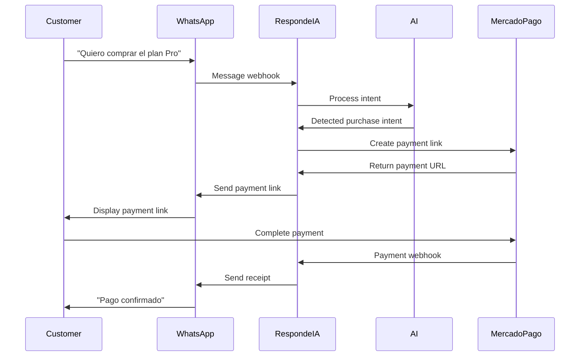

## Overview

The MercadoPago integration allows your AI assistant to generate payment links and process transactions directly within WhatsApp conversations. Customers can complete purchases without leaving the chat, creating a seamless buying experience.

<Note>
This is a new feature highlighted on our landing page: **"Nuevo: Integración con MercadoPago"**
</Note>

## What You Can Do

With the MercadoPago integration, RespondeIA enables:

- **In-chat payments**: AI generates payment links automatically during sales conversations
- **Payment status tracking**: Real-time notifications when payments are completed
- **Automatic receipts**: Customers receive confirmation messages with transaction details
- **Subscription management**: Handle recurring payments for subscription services
- **Refund processing**: Process refunds directly from the dashboard

## Prerequisites

Before connecting MercadoPago:

<Steps>
  <Step title="MercadoPago Account">
    You need an active MercadoPago business account. Create one at [mercadopago.com](https://www.mercadopago.com) if you don't have one.
  </Step>

  <Step title="API Credentials">
    Obtain your MercadoPago API credentials:
    - Access Token (for production)
    - Public Key (for client-side operations)
    
    <Info>
    You can find these in your MercadoPago dashboard under **Credentials** → **Production credentials**.
    </Info>
  </Step>

  <Step title="RespondeIA Plan">
    MercadoPago integration is available on:
    - **Pro plan**: $59/month (billed monthly) or $47/month (billed yearly)
    - **Agencia plan**: $149/month (billed monthly) or $119/month (billed yearly)
    
    Not available on the Básico plan.
  </Step>
</Steps>

## Setup

### Connect MercadoPago

<Steps>
  <Step title="Access Integration Settings">
    Navigate to **Settings** → **Integrations** → **Payments** in your RespondeIA dashboard.
  </Step>

  <Step title="Select MercadoPago">
    Click **Connect MercadoPago** and enter your credentials:
    
    ```json Credentials Required
    {
      "access_token": "APP_USR-1234567890-123456-abcdefghijklmnop",
      "public_key": "APP_USR-abcd1234-5678-90ef-ghij-klmnopqrstuv"
    }
    ```
    
    <Warning>
    Keep your Access Token secure. Never commit it to version control or share it publicly.
    </Warning>
  </Step>

  <Step title="Configure Webhooks">
    RespondeIA automatically configures webhooks to receive payment notifications:
    
    ```text
    https://api.respondeia.com/webhooks/mercadopago/{your-account-id}
    ```
    
    This webhook receives:
    - `payment.created`: New payment initiated
    - `payment.approved`: Payment successful
    - `payment.rejected`: Payment failed
    - `payment.refunded`: Refund processed
  </Step>

  <Step title="Test Mode">
    Before going live, test the integration:
    
    1. Enable **Test Mode** in integration settings
    2. Use MercadoPago test cards to simulate payments
    3. Verify webhooks are received correctly
    4. Check that AI sends confirmation messages
    
    <Tip>
    Test card: **5031 7557 3453 0604**, CVV: **123**, Expiry: any future date
    </Tip>
  </Step>

  <Step title="Go Live">
    Once testing is complete:
    
    1. Disable Test Mode
    2. Verify production credentials are entered
    3. Send a real transaction to confirm everything works
  </Step>
</Steps>

## How It Works

### Automatic Payment Flow

When a customer wants to make a purchase:



### AI-Powered Sales

The AI assistant automatically:

1. **Detects purchase intent** from customer messages
2. **Confirms details** (product, quantity, price)
3. **Generates payment link** with MercadoPago
4. **Sends link** in the conversation
5. **Tracks payment status** in real-time
6. **Confirms completion** once payment is approved

## API Integration

For custom implementations, use the RespondeIA API to create payments:

<CodeGroup>
```typescript TypeScript
interface CreatePaymentParams {
  customerId: string;
  amount: number;
  description: string;
  items?: Array<{
    title: string;
    quantity: number;
    unitPrice: number;
  }>;
}

async function createPayment(params: CreatePaymentParams) {
  const response = await fetch('https://api.respondeia.com/v1/payments/create', {
    method: 'POST',
    headers: {
      'Authorization': `Bearer ${token}`,
      'Content-Type': 'application/json'
    },
    body: JSON.stringify({
      provider: 'mercadopago',
      customer_id: params.customerId,
      amount: params.amount,
      currency: 'ARS', // or 'BRL', 'MXN', etc.
      description: params.description,
      items: params.items,
      notification_url: 'https://api.respondeia.com/webhooks/mercadopago/your-id',
      auto_return: 'approved'
    })
  });

  if (!response.ok) {
    throw new Error('Failed to create payment');
  }

  const { paymentLink, paymentId } = await response.json();
  return { paymentLink, paymentId };
}

// Example usage
const payment = await createPayment({
  customerId: 'wa:5491123456789',
  amount: 5900, // $59.00 in cents
  description: 'Plan Pro - Mensual',
  items: [
    {
      title: 'Plan Pro',
      quantity: 1,
      unitPrice: 5900
    }
  ]
});

// Send payment link via WhatsApp
await sendWhatsAppMessage(
  'wa:5491123456789',
  `Tu enlace de pago está listo: ${payment.paymentLink}`
);
```

```python Python
import requests
from typing import Optional, List, Dict

def create_payment(
    customer_id: str,
    amount: int,
    description: str,
    items: Optional[List[Dict]] = None
) -> Dict:
    """Create a MercadoPago payment via RespondeIA API"""
    
    response = requests.post(
        'https://api.respondeia.com/v1/payments/create',
        headers={
            'Authorization': f'Bearer {token}',
            'Content-Type': 'application/json'
        },
        json={
            'provider': 'mercadopago',
            'customer_id': customer_id,
            'amount': amount,
            'currency': 'ARS',
            'description': description,
            'items': items or [],
            'notification_url': 'https://api.respondeia.com/webhooks/mercadopago/your-id',
            'auto_return': 'approved'
        }
    )
    
    response.raise_for_status()
    return response.json()

# Example usage
payment = create_payment(
    customer_id='wa:5491123456789',
    amount=5900,  # $59.00 in cents
    description='Plan Pro - Mensual',
    items=[{
        'title': 'Plan Pro',
        'quantity': 1,
        'unit_price': 5900
    }]
)

print(f"Payment link: {payment['payment_link']}")
```
</CodeGroup>

## Payment Tracking

### Real-time Status Updates

Track payment status in real-time using webhooks:

```typescript Webhook Handler Example
interface PaymentWebhook {
  event: 'payment.created' | 'payment.approved' | 'payment.rejected' | 'payment.refunded';
  paymentId: string;
  customerId: string;
  amount: number;
  status: string;
  timestamp: number;
}

// RespondeIA handles webhooks automatically
// This shows the data structure you receive
function handlePaymentWebhook(webhook: PaymentWebhook) {
  switch (webhook.event) {
    case 'payment.approved':
      // AI automatically sends confirmation to customer
      console.log(`Payment ${webhook.paymentId} approved`);
      // Your custom logic here (e.g., provision service)
      break;
      
    case 'payment.rejected':
      // AI notifies customer of failed payment
      console.log(`Payment ${webhook.paymentId} rejected`);
      break;
      
    case 'payment.refunded':
      // Handle refund logic
      console.log(`Payment ${webhook.paymentId} refunded`);
      break;
  }
}
```

### Query Payment Status

Check payment status programmatically:

```typescript
async function getPaymentStatus(paymentId: string) {
  const response = await fetch(
    `https://api.respondeia.com/v1/payments/${paymentId}`,
    {
      headers: {
        'Authorization': `Bearer ${token}`
      }
    }
  );

  const payment = await response.json();
  
  return {
    status: payment.status, // 'pending', 'approved', 'rejected', 'refunded'
    amount: payment.amount,
    paidAt: payment.paid_at,
    customerId: payment.customer_id
  };
}
```

## Supported Payment Methods

MercadoPago supports multiple payment methods across Latin America:

<CardGroup cols={2}>
  <Card title="Credit Cards" icon="credit-card">
    Visa, Mastercard, American Express, Diners Club
  </Card>
  <Card title="Debit Cards" icon="building-columns">
    All major debit cards in supported countries
  </Card>
  <Card title="Cash Payments" icon="money-bill">
    Rapipago, Pago Fácil, OXXO (Mexico), Boleto (Brazil)
  </Card>
  <Card title="Bank Transfers" icon="university">
    PIX (Brazil), PSE (Colombia), Direct bank transfers
  </Card>
</CardGroup>

## Pricing Plans Integration

The AI can automatically offer pricing plans based on the source code at `/home/daytona/workspace/source/modules/prices/services/get-plans.ts:8-39`:

```typescript Plan Offerings
// RespondeIA automatically reads your pricing configuration
const plans = [
  {
    id: "basico",
    name: "Básico",
    priceMonth: 29,
    priceYear: 23,
    features: ["1 número WhatsApp", "Hasta 500 mensajes", "Respuestas automáticas IA"]
  },
  {
    id: "pro",
    name: "Pro",
    priceMonth: 59,
    priceYear: 47,
    features: ["1 número WhatsApp", "Mensajes ilimitados", "IA personalizada avanzada", "CRM de contactos"]
  },
  {
    id: "agencia",
    name: "Agencia",
    priceMonth: 149,
    priceYear: 119,
    features: ["Hasta 5 números", "Mensajes ilimitados", "Panel multi-cliente", "White-label"]
  }
];
```

The AI will present these plans when customers inquire about pricing and generate appropriate payment links.

## Refunds

### Process Refunds

Refund payments from the dashboard or API:

<CodeGroup>
```typescript TypeScript
async function refundPayment(paymentId: string, amount?: number) {
  const response = await fetch(
    `https://api.respondeia.com/v1/payments/${paymentId}/refund`,
    {
      method: 'POST',
      headers: {
        'Authorization': `Bearer ${token}`,
        'Content-Type': 'application/json'
      },
      body: JSON.stringify({
        amount: amount // Optional: partial refund amount
      })
    }
  );

  if (!response.ok) {
    throw new Error('Refund failed');
  }

  return response.json();
}
```

```bash cURL
curl -X POST https://api.respondeia.com/v1/payments/PAYMENT_ID/refund \
  -H "Authorization: Bearer YOUR_TOKEN" \
  -H "Content-Type: application/json" \
  -d '{"amount": 2950}'
```
</CodeGroup>

<Info>
Full refunds are processed within 10 business days. Partial refunds may take up to 30 days depending on the payment method.
</Info>

## Security

### PCI Compliance

RespondeIA never stores credit card information. All payment data is handled by MercadoPago's PCI-compliant infrastructure.

### Transaction Security

- **Encrypted communication**: All API calls use TLS 1.3
- **Webhook verification**: Signatures are validated to prevent spoofing
- **Access control**: Only authorized users can process refunds
- **Audit logs**: All payment actions are logged for compliance

### Fraud Prevention

MercadoPago provides built-in fraud detection:

- Device fingerprinting
- Behavioral analysis
- Transaction velocity checks
- Geographic validation

## Troubleshooting

### Payment Link Not Generated

<Steps>
  <Step title="Check Integration Status">
    Verify MercadoPago is connected: **Settings** → **Integrations** → **Payments**
  </Step>
  
  <Step title="Verify Credentials">
    Ensure Access Token and Public Key are correct and not expired
  </Step>
  
  <Step title="Check Plan Limits">
    Confirm your RespondeIA plan includes payment processing
  </Step>
</Steps>

### Webhook Not Received

1. Check webhook URL is correctly configured in MercadoPago dashboard
2. Verify firewall allows POST requests from MercadoPago IPs
3. Review webhook logs in RespondeIA dashboard

### Payment Stuck in Pending

<Warning>
Some payment methods (cash, bank transfer) take time to process. PIX is instant, but Boleto can take 1-3 business days.
</Warning>

## Analytics

Track payment performance in your dashboard:

- **Total revenue**: Sum of all approved payments
- **Conversion rate**: Payment links sent vs. completed
- **Average transaction value**: Mean payment amount
- **Payment method breakdown**: Distribution by payment type
- **Failed payment reasons**: Why transactions are rejected

## Best Practices

1. **Clear pricing**: Train AI to communicate prices clearly before generating links
2. **Fast follow-up**: AI should send payment links immediately when requested
3. **Payment reminders**: Set up automatic reminders for pending payments
4. **Localized currency**: Use the customer's local currency when possible
5. **Transparent fees**: Communicate any transaction fees upfront
6. **Receipt confirmation**: Always send receipt after successful payment

## Supported Countries

MercadoPago is available in:

- Argentina (ARS)
- Brazil (BRL)
- Chile (CLP)
- Colombia (COP)
- Mexico (MXN)
- Peru (PEN)
- Uruguay (UYU)

<Note>
Currency is automatically detected based on your MercadoPago account country.
</Note>

## Next Steps

<CardGroup cols={2}>
  <Card title="Pricing Configuration" icon="tags" href="/guides/pricing-plans">
    Set up your pricing plans and products
  </Card>
  <Card title="AI Training" icon="brain" href="/guides/customization">
    Train your AI to handle sales conversations
  </Card>
  <Card title="API Reference" icon="code" href="/integration/api-overview">
    Full payment API documentation
  </Card>
  <Card title="Analytics" icon="chart-line" href="/features/analytics">
    Track revenue and conversion metrics
  </Card>
</CardGroup>
